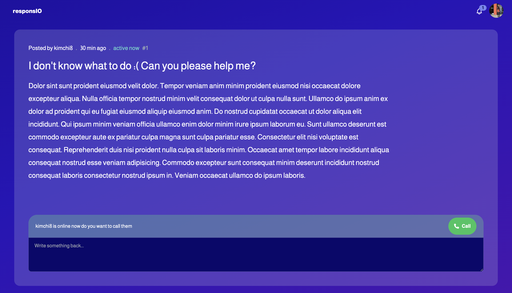
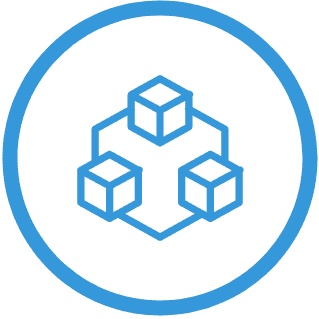
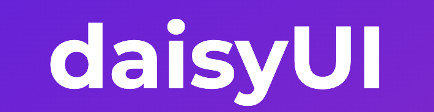

<h1 bold>🐐 ResponsIO</h1>

**ResponsIO is a Q&A platform where you can get responses to your questions quickly and easily with code editing, video calling and mathematical capabilities.**

  
  

## 🚀 Context
A picture is worth 1000 words - in our case, a video is worth a million words. Have you ever had a question that was too complex to be answered through text, or wanted to obtain first hand responses from those that are more knowledgeable or have been in your position? 

Other competitors only allow responses through chat, or from current students and staff. Our application stands out as it allows communication and collaboration from current students taking a course, cross-institutional students, staff and even alumni. With responsIO, you can now take difficult math and coding communication to the next level.

## 💫 What is included
- Real time collaboration via video
- Live multi-user code editor
- Latex for mathematical notation
- Q&A forum

## 🧑‍💻 Use Cases
- Math and coding help
- Coding interviews
- Collaborating with friends
- Finding and speaking with mentors
- Online teaching

## ✨ Interfaces
### Login

### Registration

### Forum

### Q&A

### Live Coding

### Live Math

## 🛠 Tech Stack
<table border="0">
 <tr>
    <th><b style="text-align:center font-size:30px">React</b></th>
    <th><b style="font-size:30px">Tailwindcss</b></th>
    <th><b style="font-size:30px">Typescript</b></th>
    <th><b style="font-size:30px text-align: center">Node</b></th>
    <th><b style="font-size:30px">DaisyUI</b></th>
    <th><b style="font-size:30px">MathQuil</b></th>
    <th><b style="font-size:30px">WebRTC</b></th>
    <th><b style="font-size:30px">tRPC</b></th>
 </tr>
 <tr>
    <td> &nbsp&nbsp&nbsp</td>
    <td> &nbsp&nbsp&nbsp</td>
    <td> &nbsp&nbsp&nbsp</td>
    <td> &nbsp&nbsp&nbsp</td>
    <td> &nbsp&nbsp&nbsp</td>
    <td> &nbsp&nbsp&nbsp</td>
    <td> &nbsp&nbsp&nbsp</td>
    <td> </td>

 </tr>
</table>

## 🔮 Future Plans
- Calculator with history
- User testing
- Text chat
- Shared window multi-user editing

